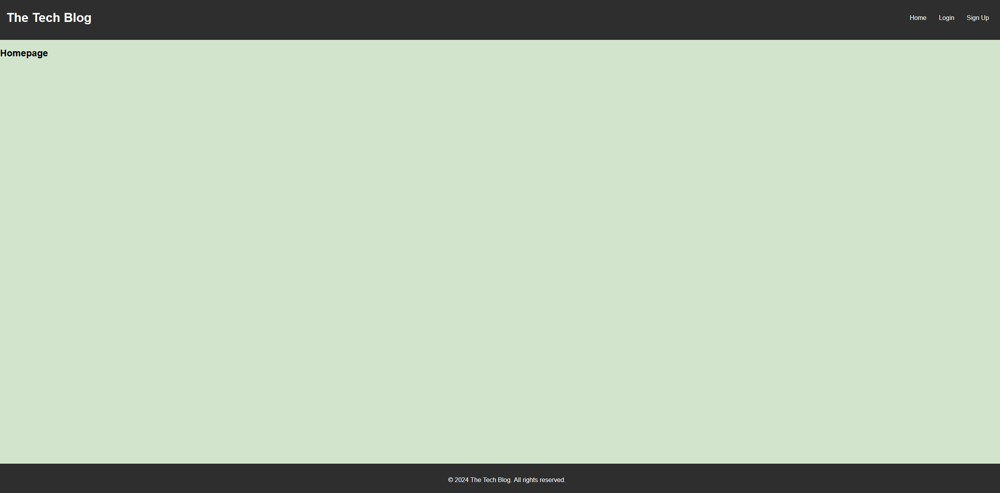

# The Tech Blog

## Table of Contents
- [Description](#description)
- [Technologies](#technologies)
- [Installation](#installation)
- [Usage](#usage)
- [Deployed Application](#deployed-application)

## Description
A CMS-style blog site where developers can publish their blog posts and comment on other developers’ posts.

## Technologies
- Express.js
- Handlebars.js
- Sequelize
- MySQL2
- dotenv
- bcrypt
- express-session
- connect-session-sequelize

## Installation
1. Clone the repository.
2. Run `npm install` to install dependencies.
3. Set up the `.env` file with your database credentials.
4. Run `npm run seed` to seed the database.
5. Run `npm start` to start the server.

## Usage
Visit the site and sign up or log in to start creating and commenting on posts.

## Deployed Application
[Heroku Link to the tech blog](https://the-tech-blog-heroku-ee1a62949e0b.herokuapp.com/)

### Screenshot of Deployed Application

